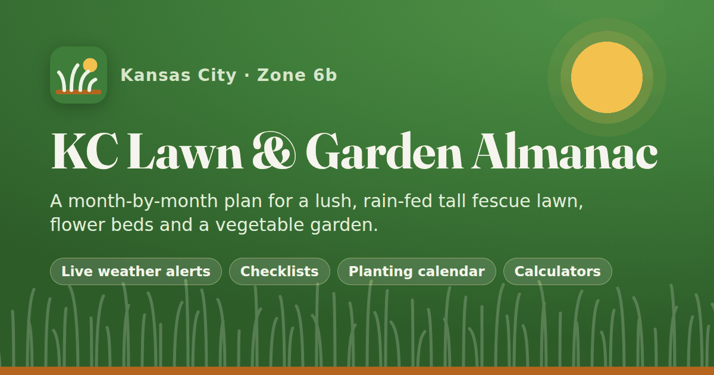

# KC Lawn & Garden Almanac

An interactive, month-by-month plan for a lush, **rain-fed tall fescue lawn**, flower beds and a
vegetable garden in the **Kansas City, MO** area (USDA zone 6b). It runs entirely
in the browser as a static GitHub Pages site. It has no build step, no accounts and no tracking.



The plan follows University of Missouri and K-State Extension guidance, backed by recent turf
research. Every task links to its sources and shows how strong the evidence is: Extension,
peer-reviewed, product label, vendor claim or folklore.

## What's inside

| Page | What it does |
| --- | --- |
| **Today** | What to do right now, what's coming in the next 3 weeks, and the month's bottom line. Live weather alerts, a nitrogen tracker, a frost countdown and quick logging. |
| **Calendar** | All 135 tasks by month or year. Filter by area or priority, add your own tasks, check tasks off, add them to your phone calendar (.ics) and print. Links like `calendar.html#/month/9` go straight to a month. |
| **Lawn** | The fall-heavy fescue program, a "Should I water today?" tool for yards with no sprinkler system, seed blends and cultivars, a seed-tag checker, the ⅓ mowing rule, a weed/disease/insect identifier and soil tests. |
| **Beds** | Bed care by month, what to prune when, a plant finder for KC clay (natives, deer, sun), trees (EAB, oak wilt), invasives, bulbs and mulch. |
| **Veggies** | MU planting dates for 41 crops (Central or North MO, or your own frost dates) on a Gantt-style timeline. Also a seed-starting schedule, a bed planner with crop-rotation warnings, a harvest log, and pest and companion-planting notes. |
| **Tools** | Calculators: lawn area, fertilizer, grass seed (including pure live seed), sprinkler run time (tuna-can test), spray mix, mulch/compost, lime and garden fertilizer. |
| **Products** | Named products with active ingredient, rate, timing, where to buy in KC and rough prices, sized to your yard. Kits and a printable shopping list. |
| **Journal** | Log mowing, fertilizer, rain-gauge readings, harvests and soil tests. Includes yearly totals, CSV export and JSON backup/restore. |
| **Library** | Research summaries, Extension guides, local help, suppliers, climate normals and frost odds, myths, a glossary and every source. |

It also has:

* Live weather from [Open-Meteo](https://open-meteo.com/) (free, no key), with alerts for:
  * drought (days since ½ in of rain)
  * brown patch
  * crabgrass (soil temperature)
  * frost and freeze
  * seeding and spraying windows
  * heat and blossom drop
* Your own rain-gauge and watering entries override the weather model.
* Works offline once visited (service worker).
* Can be installed to a phone's home screen.
* Dark mode, print styles and keyboard search (`/` or Ctrl/⌘+K).
* Checked WCAG AA with axe-core in light and dark mode.
* Everything you enter stays in your browser's local storage. The Journal page has backup and
  restore.

## Publish it with GitHub Pages

1. On GitHub, open **Settings → Pages**.
2. Under **Build and deployment**, choose **Source: Deploy from a branch**.
3. Pick the **`main`** branch and the **`/docs`** folder, then **Save**.
4. After a minute the site is live at `https://<username>.github.io/<repo>/`.

The site uses only relative links, so it also works from a fork, a custom domain or a local folder.

## Run it locally

Any static web server works. The site uses ES modules, so opening the HTML file directly won't
work.

```bash
cd docs
python3 -m http.server 8000
# then open http://localhost:8000
```

Add `?date=2027-04-08` to any page URL to preview the plan for another day. The service worker
is skipped on `localhost` unless you add `?sw=1`.

## Change the plan

All content lives in JSON files under `docs/data/`, so you can edit the plan without touching
code.

| File | Contents |
| --- | --- |
| `tasks.json` | The 135 month-by-month tasks for lawn, beds, veggies and yard |
| `months.json` | Each month's headline, bottom line and notes |
| `lawn.json` | Lawn program, watering, seed, mowing and soil guidance |
| `issues.json` | Weeds, diseases and insects (identification and control) |
| `crops.json` | Vegetable crops with MU Central/North dates and varieties |
| `garden.json` | Seed starting, garden guides, pests and companions |
| `plants.json`, `pruning.json`, `beds.json` | Plant finder, pruning table and bed guidance |
| `products.json` | Products with actives, rates, sizes, prices and where to buy |
| `sources.json` | Every source (URL, year, evidence type, key takeaway) |
| `climate.json` | KCI 1991–2020 normals and freeze probabilities |
| `library.json`, `glossary.json` | Library page content and glossary |

A task looks like this (abridged):

```json
{
  "id": "lawn-apr-preemergent",
  "title": "Apply crabgrass pre-emergent",
  "category": "lawn",
  "months": [3, 4],
  "window": { "start": "03-25", "end": "04-15" },
  "priority": "critical",
  "trigger": { "type": "bloom", "text": "Redbuds in full bloom; soil nearing 55°F" },
  "summary": "One application of prodiamine or dithiopyr, watered in, stops crabgrass all season.",
  "products": ["dimension-granular", "barricade-4fl"],
  "conflicts": ["lawn-sep-overseed"],
  "sources": ["kstate-lawn-calendar", "mu-g6705"],
  "evidence": "extension"
}
```

A few rules to keep the data consistent:

* **Dates.** Windows are `MM-DD` and may wrap past the new year. They are written for MU's
  Central region (Kansas City). The North setting and custom frost dates shift them
  automatically.
* **IDs.** Every id in `products`, `sources` and `conflicts` must exist in its file.
* **Cache.** After editing data, bump `DATA_VERSION` in `docs/js/core/data.js` and `VERSION` in
  `docs/sw.js` so returning visitors get the new files.

## How it's built

* Plain HTML, CSS and JavaScript ES modules. There are no frameworks, no npm packages and no build
  step.
* `docs/js/core/` has the shared code: templating, local storage, date windows, weather, iCal
  export, charts and calculators.
* `docs/js/pages/` has one module per page.
* The hand-drawn SVG icons and the self-hosted [Fraunces](https://github.com/undercasetype/Fraunces)
  font are the only assets. Fraunces is under the SIL Open Font License; see
  `docs/assets/fonts/OFL.txt`.

## Sources and credits

* **Guidance.** Mostly from University of Missouri Extension (G6705, G6201, MG10 and others),
  K-State Research and Extension, and MU IPM.
* **Research.** Peer-reviewed turf research, including K-State's rain-out shelter drought
  studies and the 2025 brown patch / nitrogen timing trial.
* **Weather.** Open-Meteo (CC BY 4.0).
* **Climate normals.** NOAA NCEI.

The Library page lists every source with a link. A few public GitHub garden planners inspired
features such as frost-date-driven windows, the Gantt timeline, rotation warnings and iCal export.
Only ideas were borrowed; all code here is original. The Library page credits each project.

**Always read and follow the product label. The label is the law.** Prices are rough 2026
estimates. Vendor claims are marked as marketing, not evidence.
